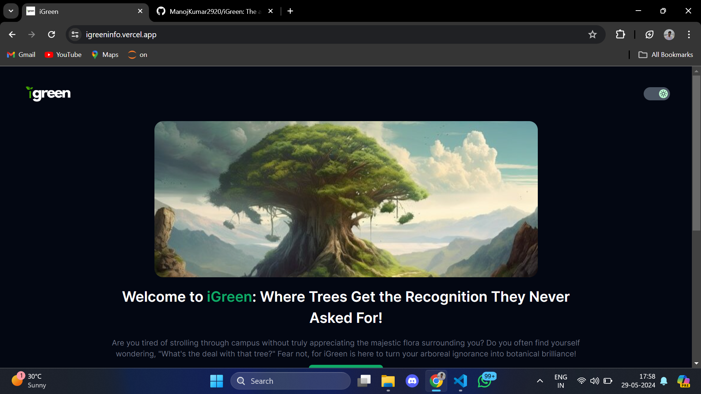

# iGreen - Campus Tree Database

Welcome to iGreen! This project, built with Next.js, aims to provide detailed information about all the trees on our college campus, promoting environmental awareness and contributing to a sustainable campus. We invite students and the broader community to contribute to this open-source initiative.

## Table of Contents

- [Introduction](#introduction)
- [Project Goals](#project-goals)
- [Getting Started](#getting-started)
  - [Prerequisites](#prerequisites)
  - [Installation](#installation)
- [Usage](#usage)
- [Contributing](#contributing)
- [License](#license)
- [Contact](#contact)

## Introduction

iGreen is a collaborative project designed to catalog and provide information on every tree on our college campus. By mapping and documenting our trees, we hope to foster a deeper connection with our environment and inspire sustainable practices within our community.

## Project Goals

- **Awareness**: Increase awareness about the variety and importance of trees on campus.
- **Education**: Provide educational resources about different tree species and their roles in the ecosystem.
- **Sustainability**: Promote sustainable practices by highlighting the benefits of trees.
- **Community Engagement**: Encourage student and community participation in environmental conservation.



## Getting Started

To get started with iGreen, follow these steps:

## Prerequisites

- Git installed on your computer.
- Node.js and npm installed.
- A GitHub account.

## Installation

1. **Clone the Repository**
   ```bash
   git clone https://github.com/ManojKumar2920/iGreen.git
   ```

2. **Navigate to the Project Directory**

   ```bash
   cd igreen
   ```
3. **Install Dependencies**

   ```bash
   npm install
   ```

## Usage

After installation, you can start exploring and contributing to the project.

To start the development server:

```bash
npm run dev
```

## Contributing


We welcome contributions from everyone! To contribute:

1. Fork the repository.
2. Create a new branch (`git checkout -b feature-branch`).
3. Make your changes and commit them (`git commit -m 'Add new feature'`).
4. Push to the branch (`git push origin feature-branch`).
5. Open a pull request on GitHub.

###

Please follow these guidelines when contributing:

- Make sure your code follows the project's coding style and conventions.
- Write clear and concise commit messages.
- Test your changes thoroughly before submitting a pull request.
- Document any new features or changes in the appropriate sections.
- Be respectful and constructive in your communication with other contributors.

For major changes, please open an issue first to discuss the proposed changes and ensure they align with the project's goals.

Thank you for contributing to iGreen! Together, let's make our campus greener and more sustainable.

## License

This project is licensed under the MIT License. See the [LICENSE](LICENSE) file for details.

## Contact

If you have any questions, suggestions, or feedback, feel free to open an issue on GitHub or contact us at manojkumararumainathan@gmail.com.

Let's work together to create a greener, more sustainable campus!

